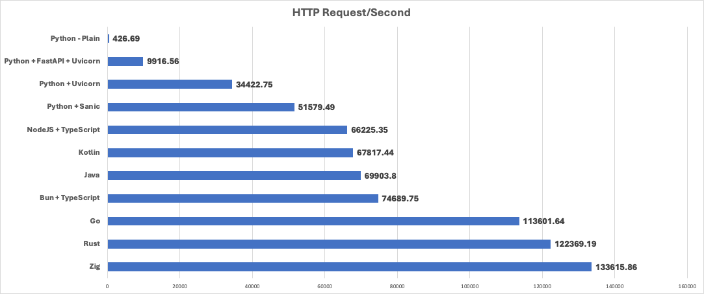

# Simple Serving Benchmark
A simple setup to demonstrate the basic performance for a variety of languages in serving HTTP requests

## Why does this exist?
I was in a friendly debate with other engineers about using Python as a server. This was a part of a larger debate about using Python for Generative AI projects. 

Python is a wonderful language that I've been using for at least 20 years. Nothing can beat how fast you can whip something up to test an idea or in the case of machine learning, get easy access to powerful number-crunching libraries like NumPy and PyTorch. Using Python to orchestrate everything below it is hard to beat.

The problem I was trying to point out is when work comes to your poor Python program. A server request that needs to be processed with a timely response. Python has always struggled with that workload due to some early architectural decisions, namely the infamous Global Interpreter Lock(GIL), which you can read more about here. The short version is that Python is single-threaded and, as a result, suffers from a lot of contention and deadlock issues.

But wait! A lot of effort has gone into addressing these issues, and there are choices. Based on that statement, I wanted to take a look, so I did the engineering thing and tried it myself. 

These tests are *in no way* scientific, but they are a good demonstration. In a reasonable same-same type setup, how do different languages fare? I decided to try a variety of different languages, all for different reasons. Some are workhorses in the server market (Java, Typescript). Some are shiny and new (Rust) Some are **really** shiny and new (Zip) For Python, I tried out a few different libraries/methodologies to improve the serving ability. Check it all out below. 

## Test setup 

**Machine specs**

Macbook M1 Pro. 32G. Sonoma 14.2

**Test tool**
[Cassowary](https://github.com/rogerwelin/cassowary)

30 concurrent users 

1 million requests

## Results

## Discussion
### Python
TL;DR - If you are serving HTTP with Python use Sanic, otherwise you'll suffer. 

### Java
TL;DR - Java is still a fast, relaible way to serve data.

### Typescript
TL;DR - Typescript is a solid choice to serve HTTP but when you do, use Bun. 

### Rust
TL;DR - I just added more proof to the "Rust is fast" but you need to be ready for the syntax. 

### Zip
TL;DR - Mind blown. If you can get past the very different dev expereince, you can't find any faster. 
